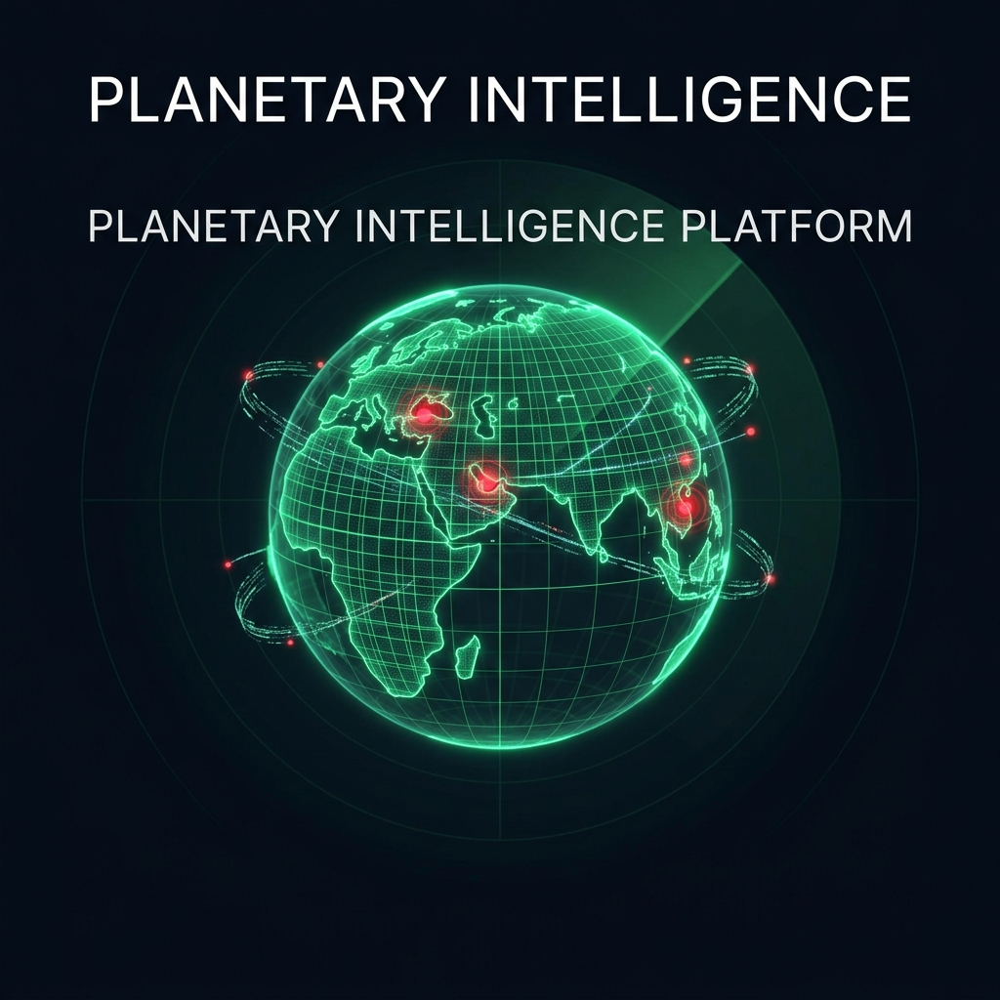
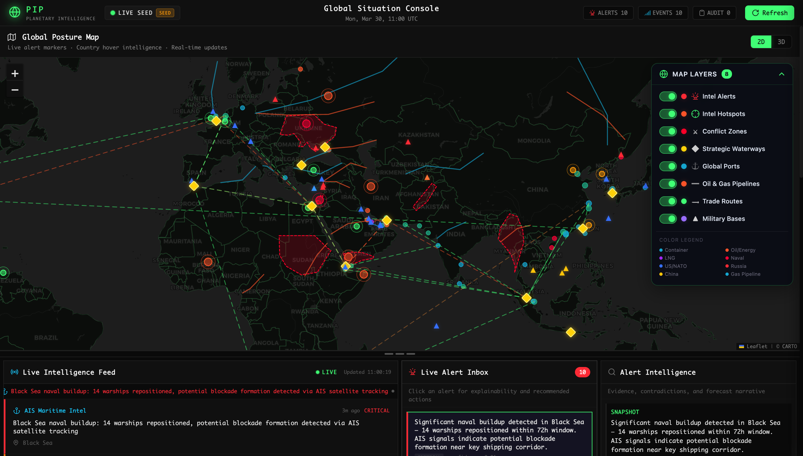
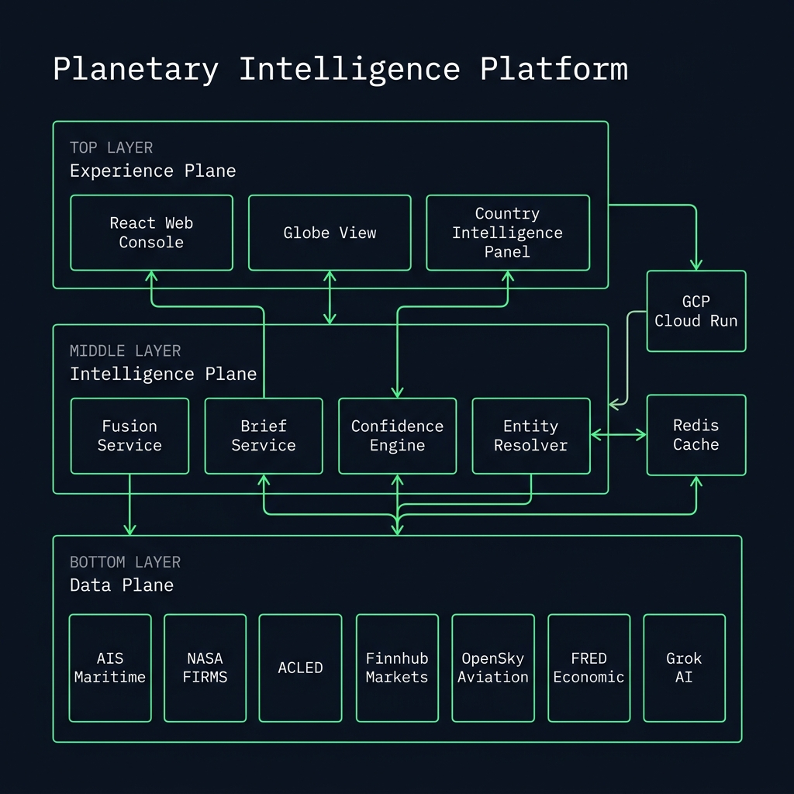
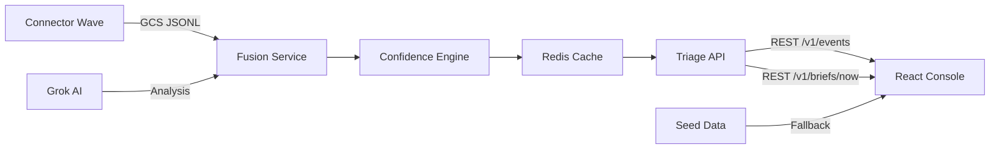

<p align="center">
  
</p>

<h1 align="center">🌍 Planetary Intelligence Platform</h1>

<p align="center">
  <b>Real-time global situation awareness powered by multi-source intelligence fusion</b>
</p>

<p align="center">
  <a href="https://pip-web-145930903164.asia-south1.run.app">
    
  </a>
  
  
  
  
  
</p>

---

## 📡 Live Dashboard Preview

> **[👉 Access the live platform →](https://pip-web-145930903164.asia-south1.run.app)**

<p align="center">
  
</p>

<p align="center"><i>Global Situation Console — 8-layer intelligence overlay with conflict zones, trade routes, pipelines, military bases, ports, and strategic waterways</i></p>

---

## 🧠 What is PIP?

**Planetary Intelligence Platform (PIP)** is a production-grade, real-time global intelligence console that fuses data from **10+ heterogeneous sources** — satellite imagery, maritime AIS transponders, military aviation transponders, commodity markets, macroeconomic indicators, conflict event databases, and AI-powered analysis — into a single, unified situational awareness dashboard.

Think of it as a **command-center-grade OSINT platform** built for the modern web.

### Key Capabilities

| Capability | Description |
|:---|:---|
| **Multi-Source Fusion** | Ingests AIS maritime, NASA FIRMS fire detection, ACLED conflict events, OpenSky aviation, Finnhub markets, FRED economic data, and EIA energy data |
| **AI-Powered Analysis** | Grok AI integration for emerging pattern recognition and natural language intelligence briefs |
| **8-Layer Geo Intelligence** | Ports (55+), Pipelines (24+), Trade Routes (12), Conflict Zones (7), Strategic Waterways (13), Military Bases (30+), Intel Hotspots (20), and live alerts — all toggleable via collapsible legend panel |
| **Confidence Scoring** | Every alert carries a machine-generated confidence score (0.0–1.0) for decision support |
| **Explainable Intelligence** | Each alert decomposes into **Snapshot → Drivers → Contradictions → Forecast** |
| **Interactive Geospatial** | 2D Leaflet map with country-click intel, GeoJSON boundaries, pulsing alert markers, and rich interactive popups for every layer |
| **Fail-Soft Architecture** | Platform remains fully functional with rich seed data even when backend APIs are unreachable |
| **Real-Time Streaming** | 15-second polling with live ticker, breaking news banners, and auto-refresh |

---

## 🏗️ Architecture

<p align="center">
  
</p>

PIP follows a **three-plane architecture** inspired by military C4ISR systems:

```
┌─────────────────────────────────────────────────────────────────┐
│                     EXPERIENCE PLANE                            │
│  React 18 + TypeScript │ Leaflet/Globe.gl │ SVG Icon System     │
│  Country Intel Panel   │ Live Feed Panel  │ Alert Explainability│
├─────────────────────────────────────────────────────────────────┤
│                    INTELLIGENCE PLANE                           │
│  Fusion Service │ Brief Service │ Confidence Engine │ Resolver  │
│  FastAPI + Redis Cache │ GCS Event Store │ Grok AI Integration  │
├─────────────────────────────────────────────────────────────────┤
│                       DATA PLANE                                │
│  AIS Maritime │ NASA FIRMS │ ACLED │ Finnhub │ OpenSky │ FRED  │
│  EIA Energy   │ AviationStack │ Grok AI │ GCS Connector Waves  │
└─────────────────────────────────────────────────────────────────┘
```

### Data Flow



---

## 🔌 Data Sources

| Source | Type | Data | Update Frequency |
|:---|:---|:---|:---|
| **AIS Maritime** | 🚢 Maritime | Vessel positions, naval activity, port congestion | Real-time |
| **NASA FIRMS** | 🔥 Satellite | Active fire hotspots, thermal anomalies | ~3h delay |
| **ACLED** | ⚔️ Conflict | Armed conflict events, political violence | Daily |
| **OpenSky Network** | ✈️ Aviation | Military/civilian flight patterns, transponder data | Real-time |
| **Finnhub** | 📈 Financial | Commodity prices, forex, market sentiment | Real-time |
| **FRED** | 📊 Economic | Macroeconomic indicators, unemployment, CPI | Weekly |
| **EIA** | ⚡ Energy | SPR levels, crude inventory, energy forecasts | Weekly |
| **AviationStack** | 🛫 Aviation | Commercial flight tracking, delay analysis | Real-time |
| **Grok AI** | 🤖 AI/ML | Pattern recognition, threat narrative generation | On-demand |
| **GCS Events** | ☁️ Storage | Connector wave JSONL event archive | Per-wave |

---

## 🖥️ Frontend Features

### Global Posture Map
- **2D Mode**: Dark-themed Leaflet map with CARTO dark tiles, GeoJSON country boundaries, and animated alert markers
- **3D Mode**: Globe.gl WebGL globe with interactive rotation
- **Country Click Intelligence**: Click any country to reveal per-nation threat levels, active signals, confidence scores, and related alerts
- **8-Layer Toggle Legend**: Collapsible glassmorphism panel with per-layer toggle switches and a color-coded legend

### Intelligence Map Layers
- **Conflict Zones**: Dashed-red polygons for active wars (Ukraine, Gaza, Sudan, Yemen, Myanmar, Lebanon, Pak-Afghan border) with casualty/displacement data
- **Strategic Waterways**: Yellow diamond markers at 13 global chokepoints (Hormuz, Malacca, Suez, Panama, Bab el-Mandeb, etc.)
- **Global Ports**: 55+ ports color-coded by type (Container, Oil, LNG, Naval, Mixed) with throughput data
- **Oil & Gas Pipelines**: 24+ pipelines rendered as polylines (oil=orange, gas=cyan) with capacity and operator info
- **Trade Routes**: 12 major maritime corridors as dashed arcs with volume data
- **Military Bases**: 30+ bases as triangular markers color-coded by nation (US/NATO, Russia, China, France, UK, India)
- **Intel Hotspots**: 20 pulsing circle markers at geopolitical monitoring points with escalation scores (1–5)

### Live Intelligence Feed
- **Breaking News Banner**: Auto-detected critical events with flash animation  
- **Scrolling Ticker**: Real-time event stream across all data sources
- **Event Cards**: Source-attributed, severity-tagged intelligence items with geo-location

### Alert Intelligence Panel
- **Explainability Fields**: Snapshot, Drivers, Contradictions, and Forecast for every alert
- **Confidence Scoring**: ML-generated confidence with visual indicators
- **Severity Classification**: CRITICAL / HIGH / MEDIUM / LOW with color-coded badges

### Design System
- **Zero Emoji**: All icons are custom SVG components (`Icons.tsx`) for pixel-perfect rendering
- **Dark Theme**: Military-grade dark UI with `#0a0e1a` base and neon green `#44ff88` accents
- **Responsive Layout**: Draggable resize handle between map and panels
- **Monospace Typography**: SF Mono / JetBrains Mono for data-dense readability

---

## 🚀 Quick Start

### Prerequisites

- **Node.js** ≥ 18
- **Python** ≥ 3.12
- **Google Cloud SDK** (for deployment)
- **Docker** (for containerized builds)

### Local Development

```bash
# Clone the repository
git clone https://github.com/shankarsingh077/Planetary-Intelligence-Platform.git
cd Planetary-Intelligence-Platform

# Install frontend dependencies
cd services/experience-plane/triage-web-v2
npm install

# Start the dev server
npm run dev
# → http://localhost:5173
```

The frontend runs independently with **built-in seed data** — no backend required for development.

### Backend Setup

```bash
# From project root
pip install -r requirements.txt  # or use .venv

# Configure environment
cp .env.staging.example .env.local
# Edit .env.local with your API keys

# Start the API server
uvicorn triage_api.app:app --host 0.0.0.0 --port 8080
```

---

## ☁️ Deployment (GCP Cloud Run)

### Production Architecture

```
┌─────────────────┐    ┌──────────────┐    ┌─────────────────┐
│  Cloud Run      │───▶│  Redis Cache  │───▶│  GCS Bucket     │
│  pip-web        │    │  Memorystore  │    │  Event Archive  │
│  asia-south1    │    │  10.x.x.x    │    │  JSONL Waves    │
└─────────────────┘    └──────────────┘    └─────────────────┘
         │
         ▼
┌─────────────────────────────────────────┐
│  Secret Manager                         │
│  API Keys: Grok, Finnhub, EIA, FRED,   │
│  AviationStack, OpenSky, AIS, ACLED,   │
│  NASA FIRMS                             │
└─────────────────────────────────────────┘
```

### Deploy

```bash
# Build and deploy to Cloud Run
gcloud builds submit --tag gcr.io/planetaryintelligenceplatform/pip-web \
  --project=planetaryintelligenceplatform

gcloud run deploy pip-web \
  --image gcr.io/planetaryintelligenceplatform/pip-web \
  --region asia-south1 \
  --platform managed \
  --allow-unauthenticated \
  --dockerfile Dockerfile.web
```

### Health Check

```bash
curl https://pip-web-145930903164.asia-south1.run.app/health
# → {"status":"ok"}
```

---

## 📁 Project Structure

```
Planetary-Intelligence-Platform/
├── services/
│   ├── experience-plane/
│   │   └── triage-web-v2/          # React 18 + TypeScript frontend
│   │       ├── src/
│   │       │   ├── App.tsx          # Main application (map, layout, data flow)
│   │       │   ├── Icons.tsx        # 25+ custom SVG icon components
│   │       │   ├── LiveFeedPanel.tsx # Breaking news, ticker, event cards
│   │       │   ├── CountryPanel.tsx  # Per-country intelligence slide-in
│   │       │   ├── MapLegend.tsx     # Collapsible 8-layer toggle legend
│   │       │   ├── geoData.ts       # Static geo datasets (ports, pipelines, etc.)
│   │       │   ├── seedData.ts      # Fail-soft fallback intelligence data
│   │       │   └── styles.css       # Complete design system (1400+ lines)
│   │       ├── public/
│   │       │   └── countries-110m.geojson  # Natural Earth boundaries
│   │       └── package.json
│   ├── intelligence-plane/
│   │   ├── brief-service/           # AI-generated intelligence briefs
│   │   ├── fusion-service/          # Multi-source data fusion engine
│   │   ├── confidence-service/      # ML confidence scoring
│   │   └── entity-resolver/         # Cross-source entity resolution
│   └── triage-api/                  # FastAPI REST gateway
├── data/
│   └── demo/                        # Sample enriched events
├── infra/                           # GCP infrastructure configs
├── deploy/                          # Deployment scripts
├── docs/                            # Documentation and assets
├── Dockerfile.web                   # Multi-stage Docker build
└── .env.staging.example             # Environment template
```

---

## 🔒 Security

- All API keys are stored in **GCP Secret Manager** and injected as environment variables at runtime
- No secrets are committed to the repository
- The `/v1/ops/counters` endpoint requires authentication headers
- The `.env.local` and `.env.live.local` files are `.gitignore`-d

---

## 📊 Performance Metrics

| Metric | Value |
|:---|:---|
| **Frontend Build Size** | ~280 KB gzipped |
| **Time to Interactive** | < 2s on 3G |
| **Data Refresh Interval** | 15 seconds |
| **Alert Processing** | 10+ concurrent sources |
| **GeoJSON Resolution** | 110m (Natural Earth) |
| **Uptime Target** | 99.9% (Cloud Run SLA) |

---

## 🛣️ Roadmap

- [x] Multi-source intelligence fusion (10 connectors)
- [x] Interactive 2D/3D geospatial visualization 
- [x] Per-country intelligence panels
- [x] AI-powered alert explainability
- [x] GCP Cloud Run production deployment
- [x] Redis caching layer
- [x] Fail-soft seed data architecture
- [x] 8-layer geo intelligence overlay (ports, pipelines, trade routes, conflict zones, waterways, bases, hotspots)
- [x] Collapsible map legend with toggle switches
- [ ] WebSocket real-time streaming (replace polling)
- [ ] User authentication and role-based access
- [ ] Custom alert rules and notification pipelines
- [ ] Historical trend analysis and time-series charts
- [ ] Mobile-responsive layout optimization
- [ ] Multi-language intelligence brief generation

---

## 🧑‍💻 Tech Stack

<p align="center">
  
  
  
  
  
  
  
  
  
  
  
</p>

---

## 📄 License

This project is for educational and portfolio demonstration purposes.

---

<p align="center">
  <b>Built with precision by <a href="https://github.com/shankarsingh077">Shankar Singh</a></b><br/>
  <sub>Fusing planetary-scale intelligence into actionable awareness</sub>
</p>
